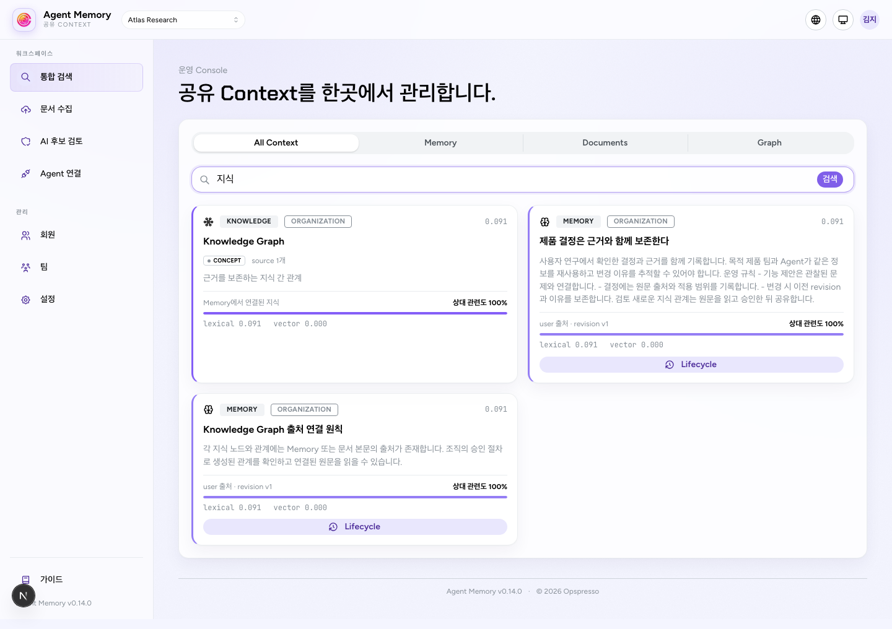
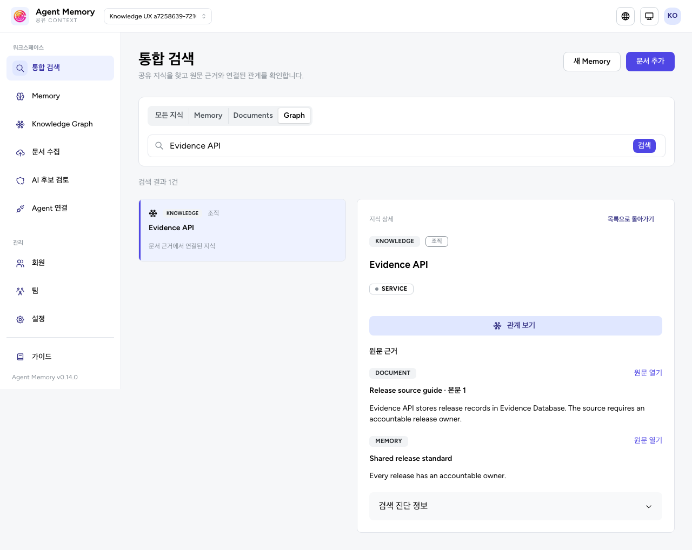
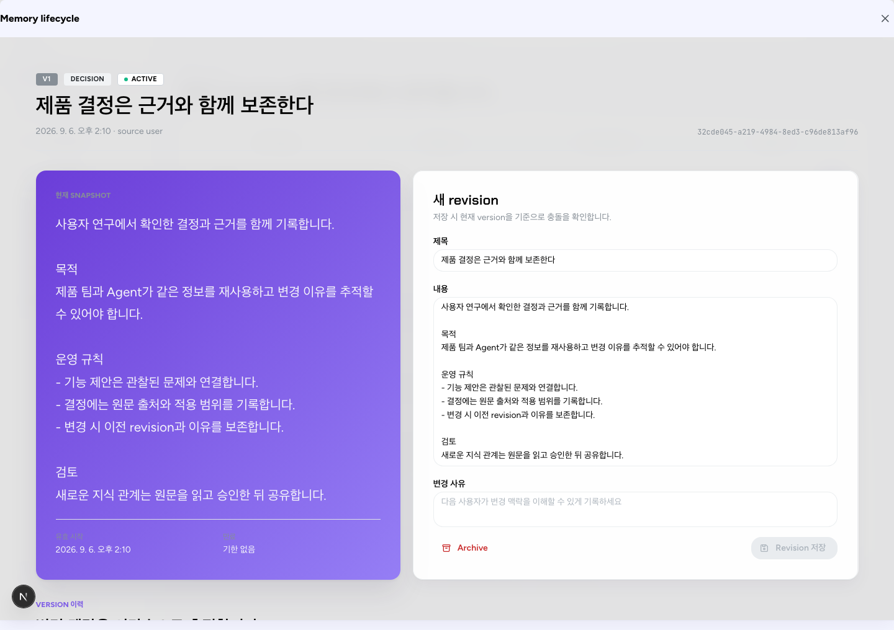
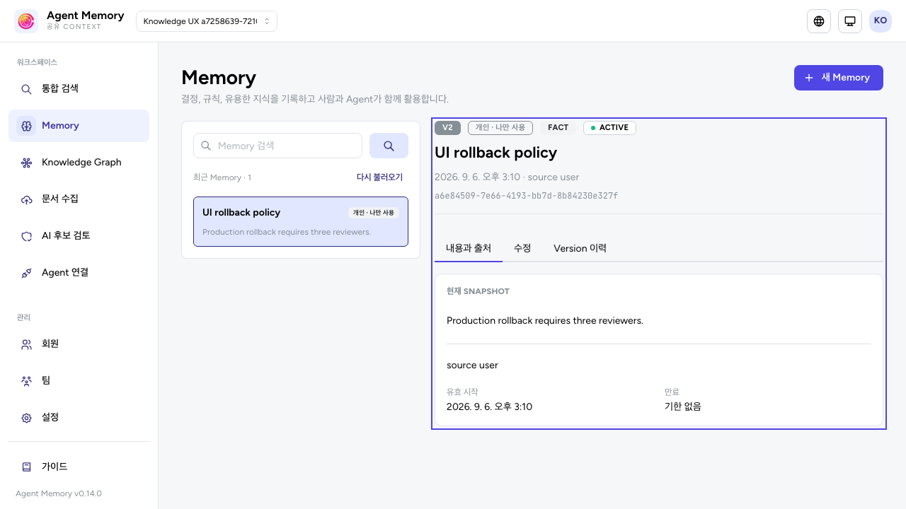
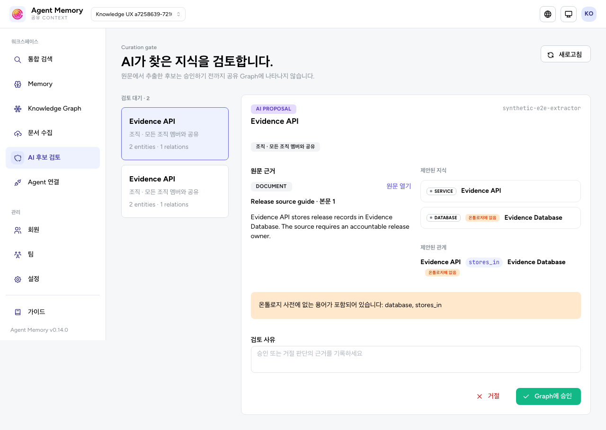

# 지식 워크스페이스 UI

Agent Memory의 화면은 지식을 수집하고, 전체 내용과 근거를 읽고, 검토한 뒤 Agent에 연결하는 흐름을 제공한다. 실행·채팅·도구 조립은 Agent Studio가 담당한다.

## 정보 구조

| 화면 | 주요 작업 |
| --- | --- |
| 통합 검색 | Memory·문서·Graph 검색, 목록과 상세 비교, 원문과 관계로 이동 |
| Memory | 최근 목록·검색, 개인·팀·조직 Memory 생성, 읽기·수정·이력 |
| 문서 라이브러리 | 업로드, 처리 상태, 실패 재처리, 처리된 원문 순차 읽기 |
| Knowledge Graph | 지식 검색, 노드 목록과 지도, 관계와 모든 provenance 확인 |
| AI 후보 검토 | 대기 목록에서 원문과 제안·중복 후보를 비교하고 승인·거절 |
| 조직 관리 | 회원 검색·상태 필터, 팀 관리, 조직·온톨로지 설정 |
| Agent 연결 | endpoint → token → Studio 등록 예시와 연결 절차 |

목록을 읽는 작업과 내용을 수정하는 작업을 구분한다. 읽기 권한만 있어도 전체 Memory와 원문을 확인할 수 있으며 수정·이력·archive 버튼은 해당 capability에 맞게 제공한다. 설치의 단일 조직을 사용하며 조직 선택기는 제공하지 않는다.

## 표현과 상호작용

- 중립 배경과 불투명한 surface, indigo 강조색, 작은 radius를 사용한다. 위험 작업의 의미별 색상을 전역 스타일로 덮지 않는다.
- 검색은 목록과 상세 패널로 구성한다. 검색 진단 점수는 펼쳐서 확인하며 상대 관련도를 신뢰 확률처럼 표시하지 않는다.
- Memory의 내용·출처, 수정, 이력을 탭으로 구분한다. 저장 후 검색 목록을 새로 읽더라도 선택한 상세와 성공 안내를 유지한다.
- 문서는 처리된 원문을 본문 순서대로 25개씩 읽는다. 원본 파일 다운로드나 새로운 포맷 변환 기능은 아니다.
- 좁은 화면에서는 상세로 이동하고 목록으로 돌아갈 수 있다. 선택·닫기 때 focus를 옮기며 키보드로 Graph의 노드 목록을 탐색할 수 있다.
- 한국어·영어와 라이트·다크 테마를 제공한다. 가입·로딩·빈 결과·권한 변경·실패·충돌 상태마다 해당 설명과 복구 동작을 제공한다.

## 비교 화면

Before는 `e559699` (`v0.14.0`)에서, After는 개편된 코드의 인증 E2E에서 캡처했다. 모두 로컬 합성 자료이며 실제 사용자가 업로드한 문서와 credential은 포함하지 않는다. 전후 fixture·자료 수·viewport는 서로 다르므로 검색 품질이나 성능 측정이 아닌 **레이아웃과 업무 흐름 비교**다.

### 검색과 근거 확인

| Before | After |
| --- | --- |
|  |  |

### Memory 읽기와 수정

| Before | After |
| --- | --- |
|  |  |

### 검토와 작은 화면

[모바일 다크 테마의 문서 읽기](ui/after-document-mobile.png)

## 검증 범위

`pnpm verify`, PostgreSQL integration, 인증 E2E로 다음 흐름을 검증한다.

- 실제 API로 Memory를 생성·수정하고 이력·공유 범위를 확인한다.
- 지연된 archive 응답이나 권한 변경 응답이 새 선택을 닫거나 오래된 내용을 재표시하지 않는다.
- 문서 pending·processing·failed·ready 상태와 retry, 원문 페이지 조회·더 보기·선택 초기화를 확인한다.
- 원문을 읽고 후보를 승인·거절하며 Graph의 여러 Memory·문서 근거를 모두 확인한다.
- 일반 멤버의 읽기와 거부되는 쓰기, 단일 조직 자동 등록과 조직 선택기 부재, 한국어·영어, 모바일과 다크 모드를 확인한다.

E2E의 문서 worker 결과는 격리된 `_e2e` DB의 합성 fixture로 재현한다. Memory의 접근 상실은 실제 PATCH 후 GET만 403으로 응답하는 fixture를 사용한다. Worker 처리와 DB tenant·상태 불변 조건은 application·integration 테스트에서 별도로 검증한다. 자동 검사 범위 밖의 모든 기기·브라우저·화면 조합을 검증한 것으로 간주하지 않는다.
